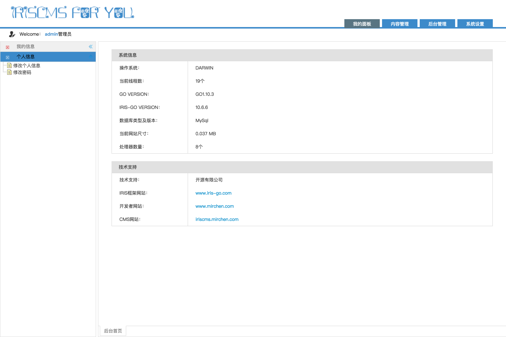
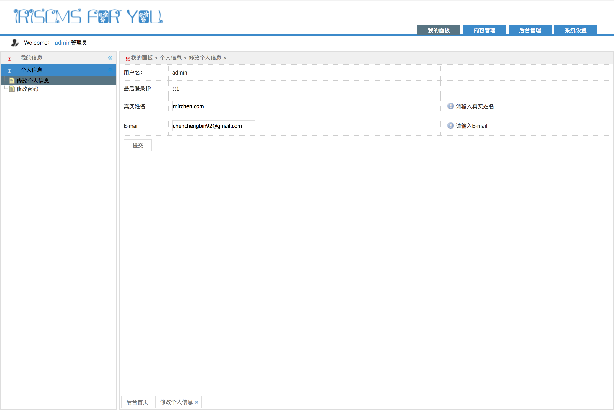
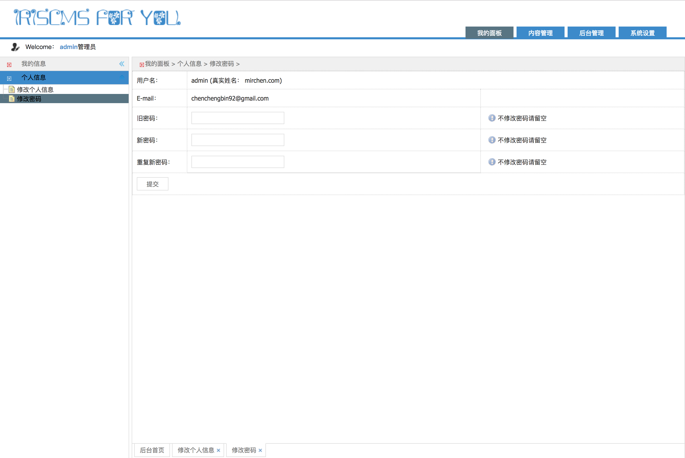
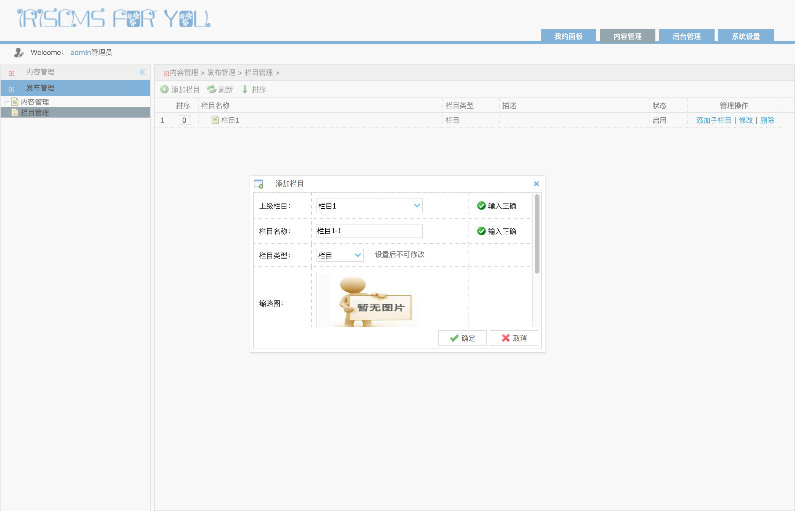
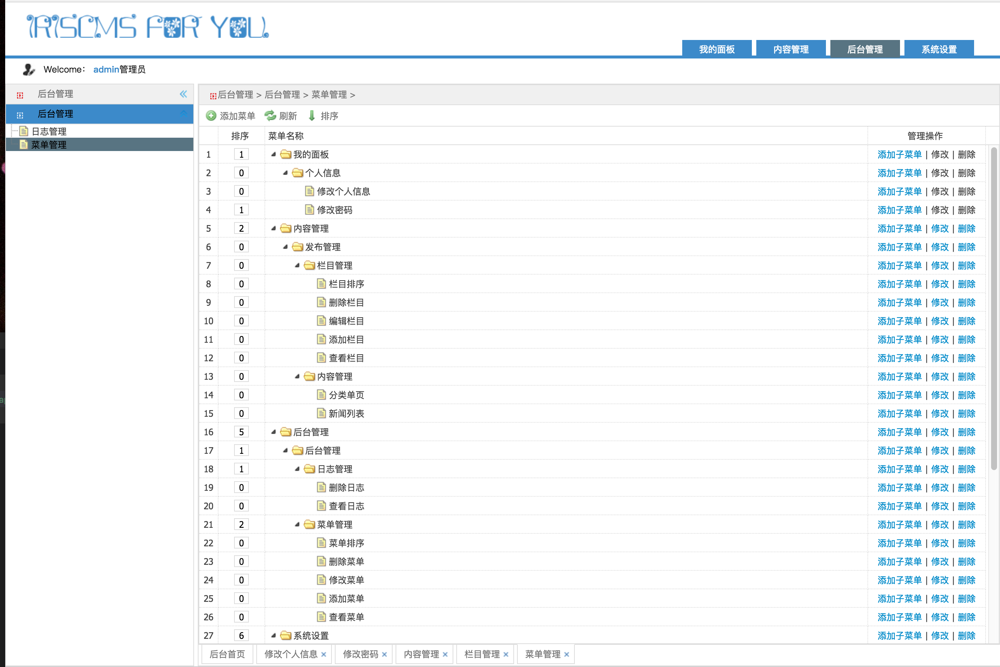
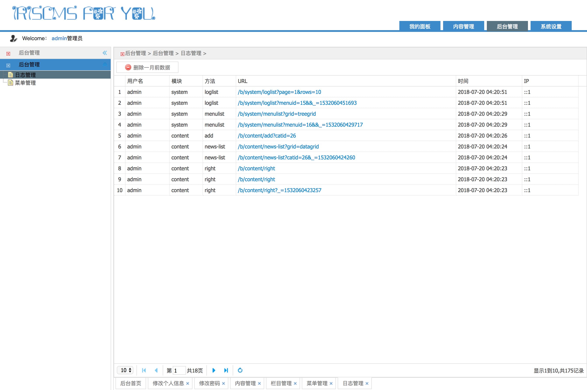
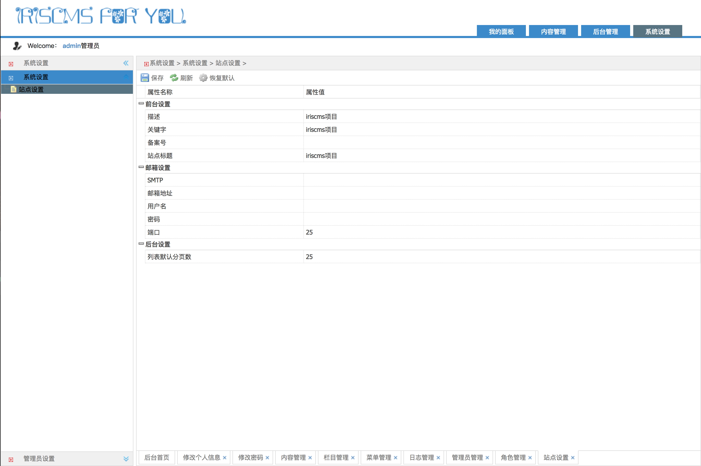
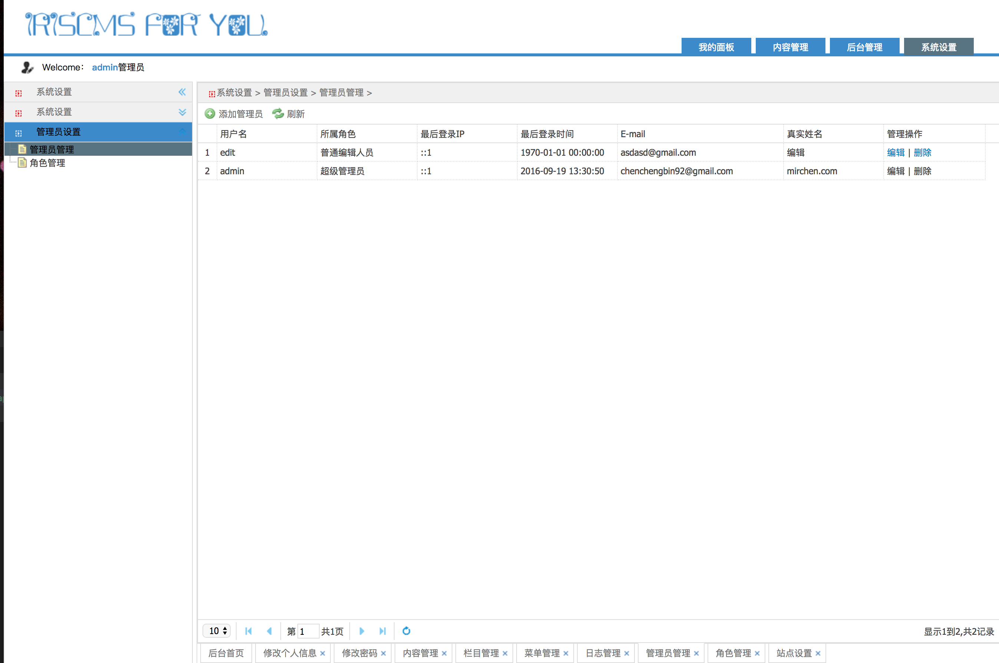
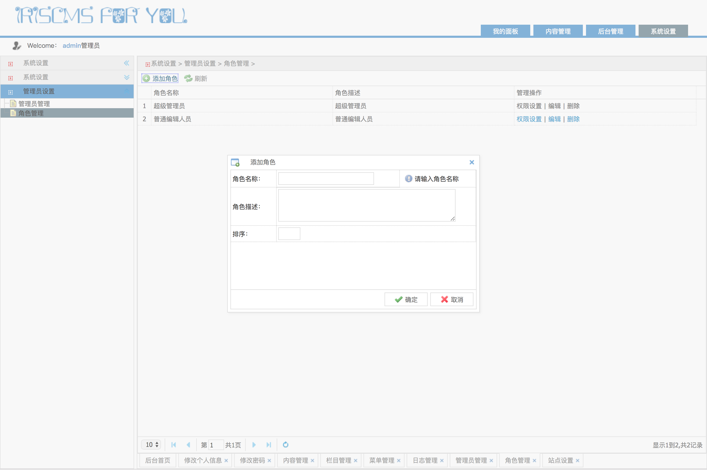

# 介绍 #
iriscms 一个简单的cms框架,基础的cms管理功能.
开发不实现相关的前端功能


# 下载部署 #
```
go get github.com/lazy007/iriscms
glide i
// 热更新
go get -u -v github.com/pilu/fresh
fresh

./main.exe or ./main
```
后台管理相关的链接统统以`resources/configs/application.yml`下的`backend_route_party的值为前缀

> 访问 http://domain.com/`:backend_route_party:`/login/index

# 数据库配置 #

修改`resources/configs/database.yml.dist`为`resources/configs/database.yml`, 配置自己的数据库

# 默认账号密码 #
```
username : admin
password : admin888
```

# 其他 #

现在开发的只有基本框架, 内容编辑当时想的是根据需求添加不同不页面模板扩展. 目前暂定使用自动生成模型的方式构建文档模型

# 预览 #












