# 项目描述 #

PineCMS是一个GO语言开发的内容管理系统, 让您可以在短时间内以制作模板的方式搭建出来一个网站, 非开发者也能快速愉悦地使用系统.
简单使用情况下无需关注代码逻辑.

> 目前程序正在持续迭代开发中，提供开发期间的数据库文件, 后期数据库结构变更比较大， 请勿用于重要场景。

# 编译部署 #

## 下载并编译 ##

---

```markdown
 git clone https://github.com/xiusin/pinecms.git
 cd pinecms
 go build -o pinecms
```

---

## 配置 ##

1. 执行数据链接生成命令: `./pinecms serve install`

2. 数据库配置
    > 导入数据库结构`resources/pinecms.sql`
    >
    >修改`resources/configs/database.yml.dist`为`resources/configs/database.yml`
    >
    > 配置数据源

3. 安装依赖
    > `go build`

4. 运行项目
    > `./pinecms serve start`

5. 开发期间自动构建
    > `go run main.go serve dev`

6. 访问后端登陆页面
    > 访问 `http://localhost:2019/admin/` 默认账号密码 `用户名: admin 密码: 123456`

# 自动静态化路由 #

完全自动静态文件和动态路由. 更友好的SEO方式

# 主题系统 #

系统支持多种主题, 可自由切换不同风格的模板. (一般需要相同类型模型, 字段一致, 减少错误问题)

# 内置模块 #

1. 用户管理：用于维护管理系统的用户，常规信息的维护与账号设置。
2. 角色管理：角色菜单管理与权限分配、设置角色所拥有的菜单权限。
3. 菜单管理：配置系统菜单，操作权限，按钮权限标识等。
4. 职级管理：主要管理用户担任的职级。
5. 岗位管理：主要管理用户担任的岗位。
6. 部门管理：主要管理系统组织架构，对组织架构进行统一管理维护。
7. 操作日志：系统正常操作日志记录和查询；系统异常信息日志记录和查询。
8. 字典管理：对系统中常用的较为固定的数据进行统一维护。
9. 配置管理：对系统的常规配置信息进行维护，网站配置管理功能进行统一维护。
10. 城市管理：统一对全国行政区划进行维护，对其他模块提供行政区划数据支撑。
11. 友链管理：对系统友情链接、合作伙伴等相关外链进行集成维护管理的模块。
12. 个人中心：主要是对当前登录用户的个人信息进行便捷修改的功能。
13. 广告管理：主要对各终端的广告数据进行管理维护。
14. 站点栏目：主要对大型系统网站等栏目进行划分和维护的模块。
15. 会员管理：对各终端注册的会员进行统一的查询与管理的模块。
16. CMS管理: 可以系统设置不同的模型数据并添加不同的逻辑。
17. 插件管理: 可以扩展/下载第三方开发的软件包。
18. 微信管理: 可以管理素材，会员，信息，自动回复等。

# 文档 #

[doc.xiusin.cn](http://doc.xiusin.cn/)

# 演示 #

- 首页 <http://pinecms.xiusin.cn/>
- 后端 <http://pinecms.xiusin.cn/b/login/index>
- 新版后端 <http://new_pinecms.xiusin.cn/>

# 新功能 #

## ApiDoc 管理插件 ##

内置集成接口ApiDoc插件, 支持从请求参数到响应结果的自动生成`略微侵入代码: 需要设置分组名称以及接口名称`. 可以在管理界面修改参数以及全局参数, 接口db可以随意迁移, 支持直接调试请求. 

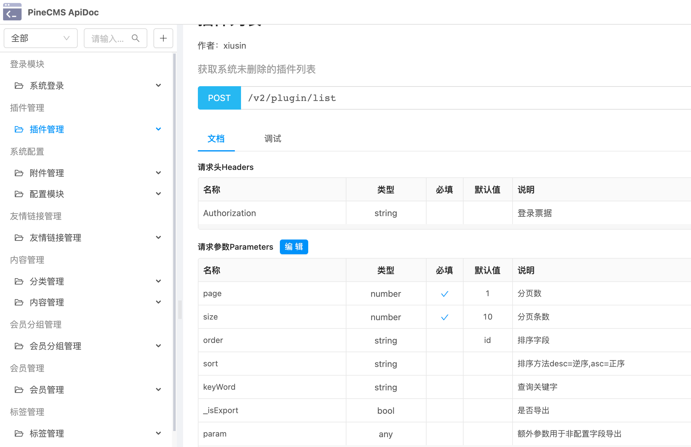

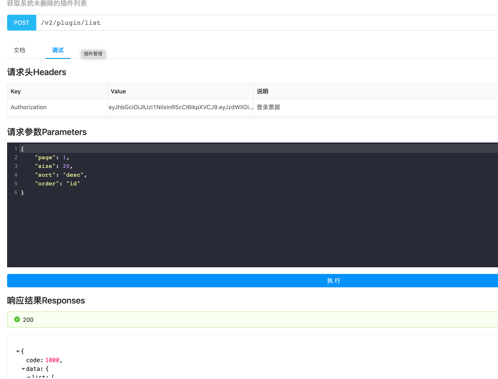

## 插件系统 (doing) ##

支持动态插拔插件, 并注册到系统功能, 提供方便便捷的扩展功能.
系统可以动态扫描插件目录,自动发现并可以热加载进系统.  
也可以导入第三方人员开发的扩展动态库(受限于系统和版本,后面会提供编译个版本的docker镜像)

- 插件系统界面
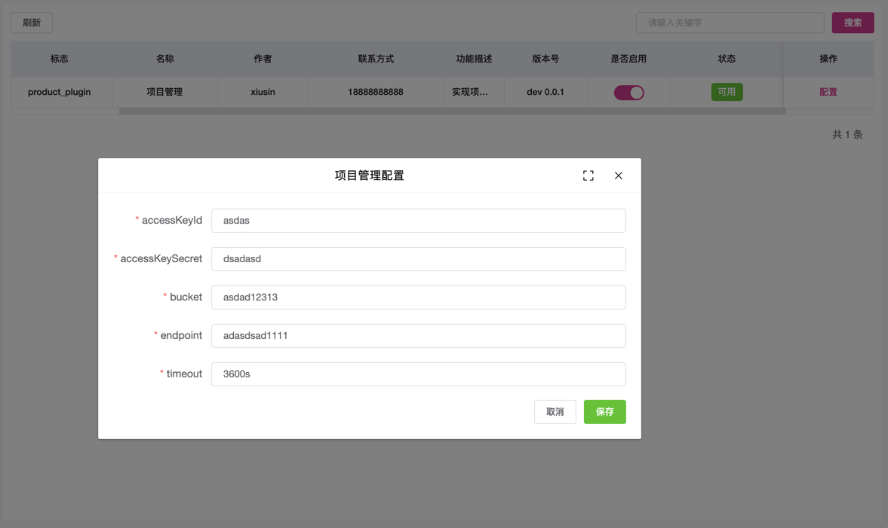


## 服务器监控 ##

> 常用的系统资源监控, 以及环境检测

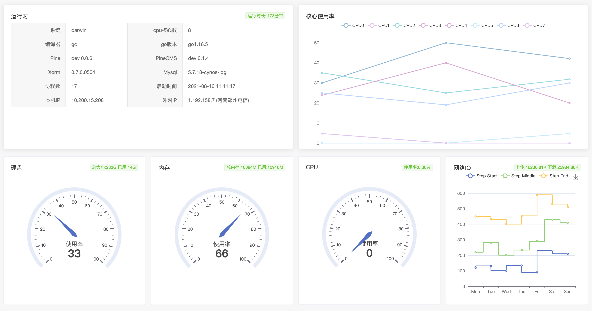

## 模型配置 ##

- 模型列表

> 模型管理界面


  
- 模型变更SQL

> 当模型变更时,会检测变更生成执行SQL, 需要手动操作

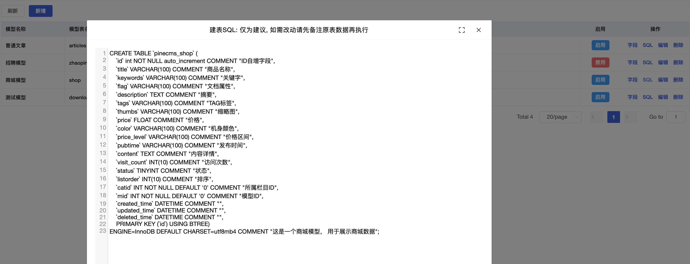

- 模型字段界面
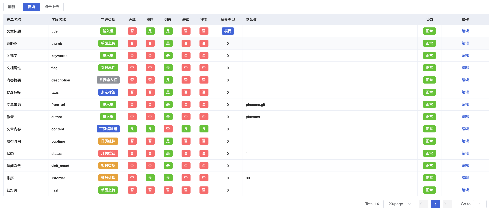
  
- 添加字段界面

> 内置CMS常用字段, 可以设置表单显示, 列表显示, 可搜索字段, 搜索类型

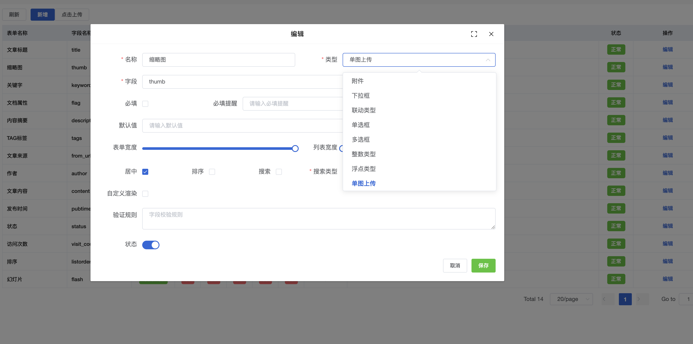

- CRUD命令

> 允许直接从表创建crud模块, 根据表字段自动解析form, 区别于cms是此命令仅适用于开发区间

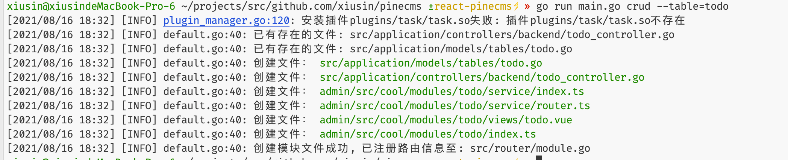

## 微信模块 ##

- 账号授权
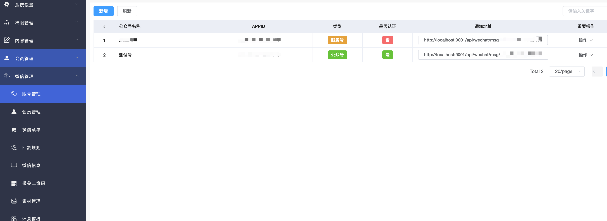
  
- 会员管理
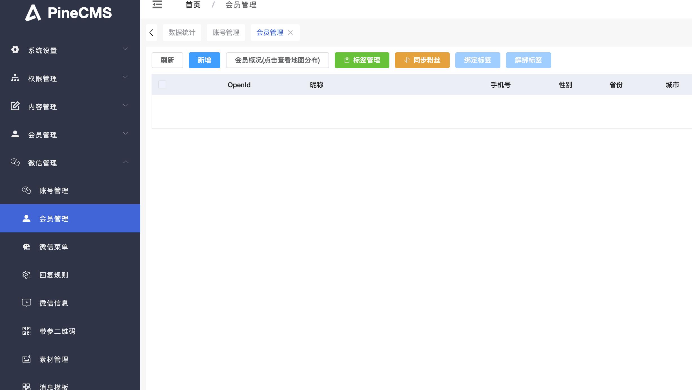
  
- 菜单管理
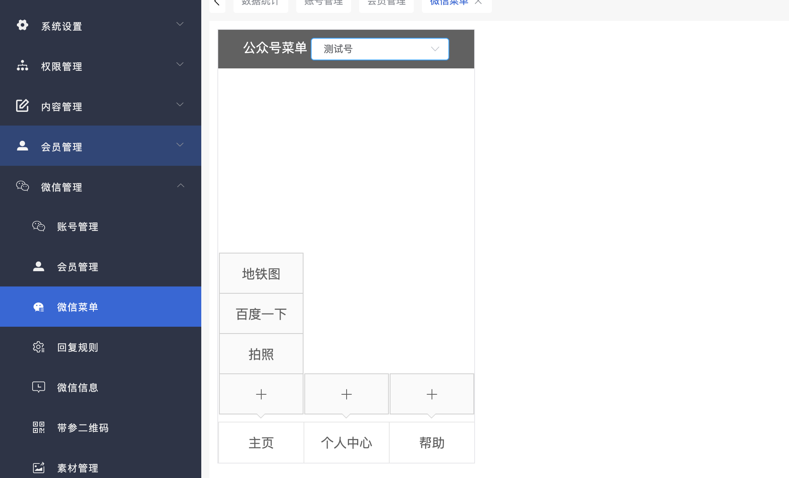
  
- 消息管理
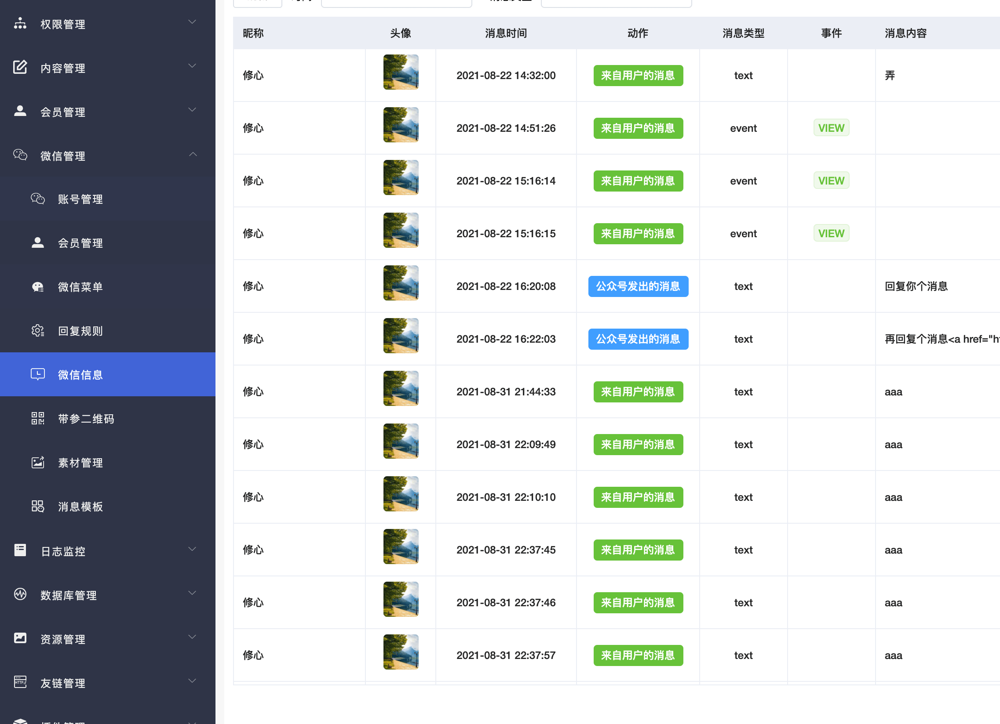
  
- 模板管理
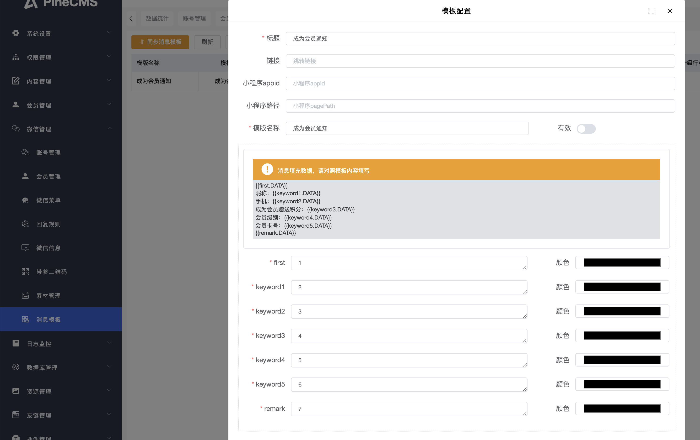

# Doing #

- 权限系统完善到按钮级别
- 系统内部BUG修复，图片处理
- 图片系统以及md5处理
- cms系统完善表单字段自定义配置（可自定义模型页面），搜索字段配置（不使用高级搜索表单）
- 插件公共页面配置 （.so下载，源代码下载）
- 插件允许暴露公共前端页面
- 微信插件
  - 素材管理
  - 自动回复素材功能
  - 客服消息

- redis manager管理插件

# TODO #

- github.com/gokeeptech/gktemplate
- Bleve 全文检索 （插件提供）
- <https://github.com/lljj-x/vue-json-schema-form>
- <http://goframe.ele.rxthink.cn/tool/generate>
- <https://github.com/antonmedv/codejar#getting-started>
- 插件扩展OnFree销毁全局变量

# 注解路由开发 #

---

```go

// @Service(sign=true, name="默认解析为实例注释, 此处可填写为实例化内容")

// @Group("/anno")
type AnnoController struct {
    //@Share(field) 看是否可以实现解析注入
    Field *int
}

// @Post("/list", xxxxxxx)
func (a *AnnoController) List() {

}

// @Request(methods=[GET,POST], "默认为方法名小驼峰, 填写则为填写名称")
func (a *AnnoController) List() {

}
```

---

# 关于权限系统 #

- Casbin: <https://zhuanlan.zhihu.com/p/148353743>
- 菜单表增加perms字段， 可以配置权限标识，可以配置节点类型为权限。
- <http://relation-graph.com/#/demo/scene-network> 组织架构显示
- <https://eddyzhang1986.github.io/antd-jsonschema-form/>

<!-- 热门语言卡片 -->
<!-- https://github-readme-stats.vercel.app/api/top-langs/?username=xiusin&layout=compact -->

<!-- 统计卡片 -->
<!-- https://github-readme-stats.vercel.app/api?username=xiusin&show_icons=true&theme=radical -->

<!-- https://github-readme-streak-stats.herokuapp.com/?user=xiusin&theme=monokai-metallian&hide_border=true -->

<!-- https://github.com/ashutosh00710/github-readme-activity-graph -->
<!-- <a href="https://github.com/ashutosh00710/github-readme-activity-graph"></a> -->